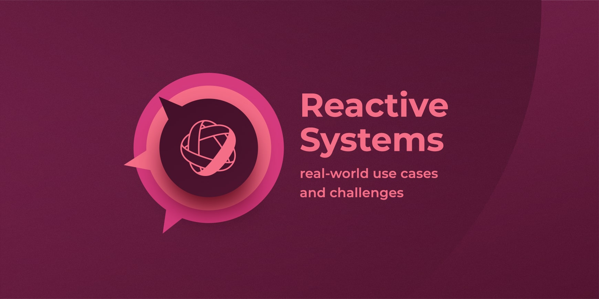

# 响应式概述

说起响应式，就不得不先说下响应式宣言[Reactive Manifesto](https://www.reactivemanifesto.org/).

如果你觉得该渲染阅读有困难，友情奉上中文版的宣言[响应式宣言中文版](https://www.reactivemanifesto.org/zh-CN).

阅读该宣言之后，大家有啥想法么？

我估计大多数人和我一样，可能觉得有点“头大”，因为读完之后，也不知道啥是响应式！

其实，该宣言并没有给响应式下定义，而是描述了一种系统设计的要求范式，如果你的系统设计(包括架构设计)具备以下特质：**即时响应性（Responsive）**、**回弹性（Resilient）**、**弹性（Elastic）**以及**消息驱动（Message Driven）**。 我们称这样的系统为反应式系统（Reactive System）。

上面的图片可以看得出，从上到下分为三个层级，最顶层是我们需要追求的**价值**，是响应式系统设计的目的，包括`及时响应性`， `可维护性`, `可扩展性`等，其中最重要的是`及时响应性`，该特性要求系统只要有可能，就尽量及时作出响应。也就是说一个响应式的系统，需要具备在服务正常或者异常的情况下，都需要及时的对外部请求做出响应，响应可以是正常内容也可以是异常情况下的快速失败。

中间层表示的是实现该价值的形式，包括`弹性`和`回弹性`。

* **回弹性：** 系统在出现失败时依然保持即时响应性，当某个模块出现问题时，需要将这个问题控制在一定范围内，这便需要使用隔绝的技术，避免连锁性问题的发生。
* **弹性：** 系统在不断变化的工作负载之下依然保持即时响应性。也就是能够根据系统的负载频率，动态调整系统的吞吐量，来满足即时响应性。

最底层描述的就是实现该价值的手段啦，最主要的方式是通过消息驱动的方式。消息驱动是实现上述三项的技术支撑，反应式系统依赖异步的消息传递，从而确保了松耦合、隔离、位置透明的组件之间有着明确边界。

所以，我们总结如下：

***响应式宣言并不是一种编程范式，而是一组原则和指导方针，用于构建具有响应式特性的软件系统，进而指导系统架构的设计！***

## 响应式编程

响应式编程是一种声明式编程范式。要理解这种范式，我们先了解一下命令式编程范式。

在命令式编程环境中，`a = b + c` 表示将表达式的结果赋给`a`，而之后改变`b` 或 `c` 的值不会影响`a`。但在响应式编程中，`a`的值会随着`b`或`c`的更新而更新。电子表格程序就是响应式编程的一个例子。单元格可以包含字面值或类似"=B1+C1"的公式，而包含公式的单元格的值会依据其他单元格的值的变化而变化。

所以，***响应式编程是一种基于数据流的，非阻塞的异步编程范式！***

这里需要明白的一个点是，响应式编程是一种数据流编程，关注于数据流而不是控制流。数据流偏向于消息驱动，而事件流侧重于事件驱动：
1. 消息驱动有确定的目标，一定会有消息的接受者，而事件驱动是一件事情希望被观察到，观察者是谁无关紧要。消息驱动系统关注消息的接受者，事件驱动系统关注事件源。
2. 在一个使用响应式编程实现的响应式系统中，消息擅长于通讯，事件擅长于反应事实。

## 背压(回压)

## 响应式发展历史

Reactive Extensions (Rx): 2009, 反应式编程最早由 .NET 平台上的 Reactive Extensions (Rx) 库来实现。
RxJava 库是 JVM 上反应式编程的先驱，也是反应式流规范的基础。
Reactive Streams: Reactive Streams （简称为 RS）是“一种规范，它为基于非阻塞回压的异步流处理提供了标准”。它是一组包含了 TCK 工具套件和四个简单接口（Publisher、Subscriber、Subscription 和 Processor）的规范，这些接口将被集成到 Java 9.
Reactor: Reactor 则是完全基于反应式流规范设计和实现的库，没有 RxJava 那样的历史包袱，在使用上更加的直观易懂。
Reactor 是第四代响应式框架，跟RxJava 2 有些相似。Reactor 项目由Pivotal 启动，以响应式流规范、Java8 和ReactiveX 术语表为基础。它的设计是Reactor 2（上一个主要版本）和RxJava 核心贡献者共同努力的结果。

https://skyao.io/learning-reactor/docs/introduction/history.html

## 常用响应式框架

