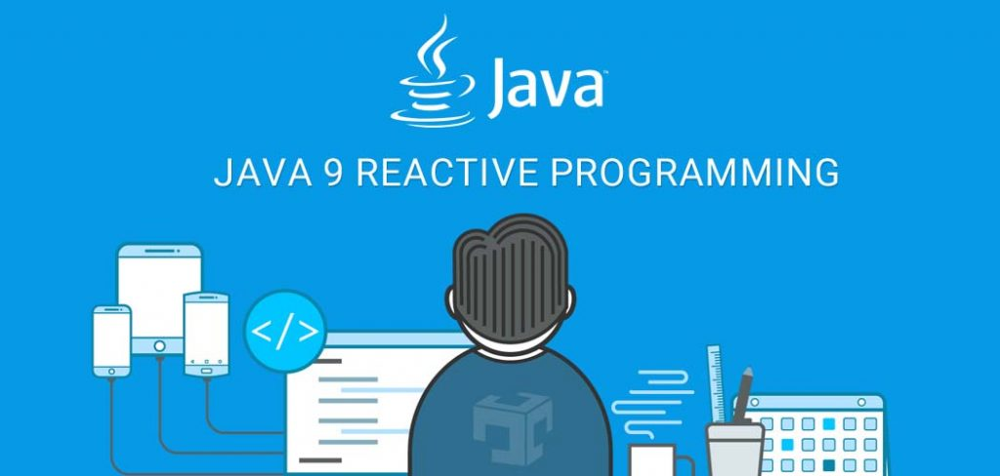
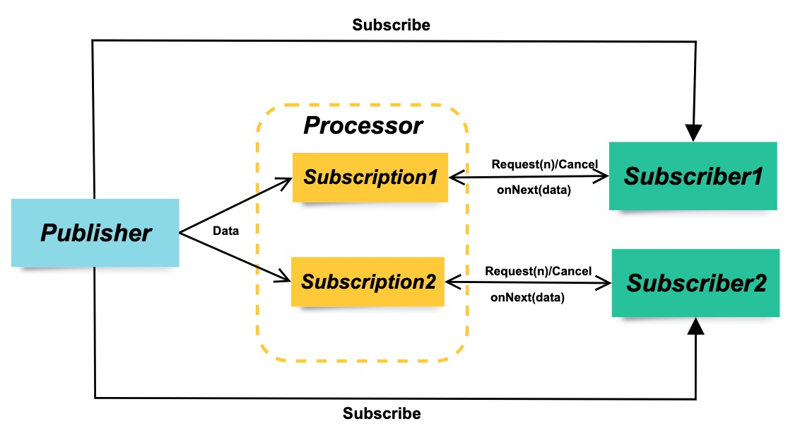

# Java Reactive Streams



Reactive Streams，翻译为反应式流，从名字上完全无法理解它的意义，像是两个硬凑在一起的词汇。事实上，它并不是一个全新的事物，异步编程大家都有了解，Java里典型的多线程处理就是异步编程。而异步编程时，存在很多难题，比如典型的回调地狱(Callback Hell)，一层套一层的回调函数简直是个灾难，为了解决异步编程过程中出现的种种难题，人们提出了各种各样方法来规避这些问题，这些方法称为反应式编程(Reactive Programming).

可以理解为：
> Reactive Programming =  Streams + Operations

Reactive Stream，响应式规范，即响应式流，是一个异步Stream 的响应式规范标准，它定义了实现响应式编程时的 API（类似于 JDBC 标准 API），囊括多种语言，其中 JVM 平台的API定义规范可以参考[reactive-streams](https://www.reactive-streams.org/).

对于Java程序员，Reactive Streams是一个API。Reactive Streams为我们提供了Java中的Reactive Programming的通用API。

## 两种角色和两种关系

Reactive Streams API为我们定义了两种角色和两种处理关系，他们分别是四个接口`Publisher`, `Subscriber`, `Subscription`, `Processor`组成。关系如下：



这四个接口都被集成到Java 9 Flow类里面了，我们来看看这些接口都定义了那些职责：

```java
//发布者
public interface Publisher < T > {
	public void subscribe(Subscriber <？super  T >  s; // 订阅一个消费者
}

//订阅者
public interface Subscriber < T > {
	public void onSubscribe(Subscription  s); // 开始订阅
	public void onNext(T  t); // 准备消费下一个数据
	public void onError(Throwable  t);  // 处理异常发生的情况
	public void onComplete();// 消费完成
}

//表示Subscriber消费Publisher发布的一个消息的生命周期
public interface Subscription {
	public void request(long n); // 每次请求订阅的量级，实现背压的关键
	public void cancel(); // 取消订阅
}

//处理器，表示一个处理阶段，它既是订阅者也是发布者，并且遵守两者的契约
public interface Processor<T, R> extends Subscriber<T>, Publisher<R> {	
}
```


