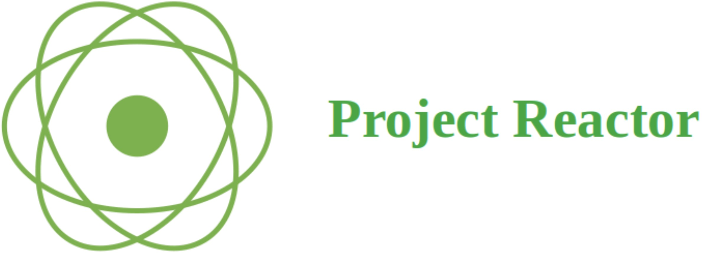

# Project Reactor

通过前面一节的学习，我们知道Java9里面引入了标准的Reactive Stream API，即`java.util.concurrent.Flow`这个类。这个类里面规定了 Java 响应式编程所要实现的接口与抽象。但是这里大家可能会发现两个问题：

1. Java 9仅仅提供了API，自带的实现非常粗糙，很难基于此构建一个真正的响应式系统。
2. Java 8提供了流式编程，很多项目是基于Java 8构建的，那么如何兼容Java 8这个版本呢？

所以，响应式编程并不是只针对系统中的某一组件，而是需要适用于调用链路上的所有组件，只要有一个环节不是响应式的，那么这个环节就会出现同步阻塞！

Spring官方敏锐的发现了这两个问题，于是启动了Project Reactor项目:[Reactor](https://github.com/reactor).

Reactor 项目主要包含 Reactor Core 和 Reactor Netty 两部分。Reactor Core 实现了反应式编程的核心功能，Reactor Netty 则是 Spring WebFlux 等技术的基础。目前最新的3.X版本以Java 8作为基线，成为了业界最先进的响应式库。

