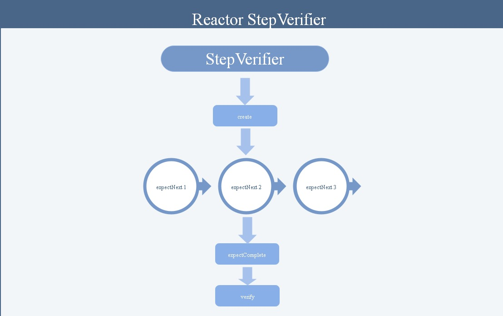

# Poject Reactor Test


前面的例子中，我们使用了`System.out.println()`的方式，通过屏幕输出来查看最终的结果，这种方式不仅低效，而且还需要将当前线程Sleep一下，非常不合理。由于本人是TDD的践行者，对这种通过打印输出来查看结果的方式很反感，今天我们就从测试的角度来聊聊，如何给响应式流写测试。

相比于传统的测试，响应式流的测试有些不同，主要的不同在于响应式流式异步的，只有被订阅者触发之后，才能产生数据。同时在整个过程中，还需要考虑`OnError`和`OnComplete`等的处理方式，所以不管是在写法上还是在理解上，对初学者来说都有些困难，想学习它的话，请做好心理准备。

估计Reactor官方也想到了这个问题，所以在Project Reactor Core中给我们提供了相关的依赖，你只需要引入他们即可：
```xml
<dependency>
    <groupId>io.projectreactor</groupId>
    <artifactId>reactor-test</artifactId>
</dependency>
```

## StepVerify

`reactor-test`核心接口为StepVerifier，该接口提供了若干的静态工厂方法，从待测试的Publisher创建测试步骤。测试步骤被抽象为状态机接口FirstStep、Step和LastStep，分别代表了测试的初始阶段、中间阶段和最终阶段。这些Step上都具有一系列的expect和assert方法，用于测试当前状态是否符合预期。



使用StepVerifier测试Publisher的套路如下：
1. 首先将已有的Publisher传入StepVerifier的`create`方法。
2. 多次调用`expectNext`、`expectNextMatches`方法设置断言，验证Publisher每一步产生的数据是否符合预期。
3. 调用`expectComplete`、`expectError`设置断言，验证Publisher是否满足正常结束或者异常结束的预期。
4. 调用`verify方`法启动测试。

例如：
```kotlin
@Test
fun test() {
    StepVerifier.create(Flux.just(1, 2, 3))
        .expectNext(1)// 依次验证数据是否符合预期
        .expectNext(2)
        .expectNext(3)
        .expectComplete() //验证Flux流是否正常关闭
        .verify() // 启动测试
}
```

### 对异常的断言
对于异常的处理，可以使用`expectError`来做断言处理！

```kotlin
@Test
fun test_error() {
    StepVerifier.create(Flux.just(1, 2, 3).handle<Int> { it, sink ->
        if(it == 2) {
            sink.error(RuntimeException())
            return@handle
        }
        sink.next(it)
    })
        .expectNext(1)// 依次验证数据是否符合预期
        .expectError(RuntimeException::class.java)
        .verify() // 启动测试
}
```

### 对元素特征的判断

之前的测试中，Publisher中数据的值都是确定的，所以可以使用expectNext进行判断，但是很多场景下，数据的值不完全确定，只知道数据的特征或者数据量太大，无法一一写出具体的值，此时`expectNextMatches`方法, 直接传入Predicate进行判断。`expectNextSequence` 这个方法接受一个集合，可以响应式流里面的每个元素生成的序列是否相等。

例如：
```kotlin
@Test
fun test_odd() {
    StepVerifier.create(Flux.range(0, 100).filter{it % 2 == 0})
        .expectNextMatches{it % 2 == 0}
        .expectNextCount(49)
        .verifyComplete();
    
    var odds = IntStream.range(0, 100).filter { it % 2 == 0 }.toList()
    StepVerifier.create(Flux.range(0, 100).filter { it % 2 == 0 })
        .expectNextSequence(odds)
        .expectComplete()
        .verify()
}
```

## StepVerify 源码结构

下面我们来简单了解一下StepVerify的源码结构，以便我们深入的了解响应式的测试框架！下面是该类的主要接口和方法。

### StepVerify接口
```java
public interface StepVerifier {
    /**
     用于创建自定义的 Flux 或 Mono 的一种方式。它允许您通过编程方式创建 Flux 或 Mono，以便进行更复杂和灵活的流处理。
     **/
    static <T> FirstStep<T> create(Publisher<? extends T> publisher) {
		return create(publisher, Long.MAX_VALUE);
	}

    /**
     用于在测试中模拟虚拟时间的推进。在 Reactor 中，操作符（operator）通常涉及到时间的处理，例如 delayElements 和 interval 等。当运行测试时，这些操作符的默认行为会导致测试执行时间过长，因为它们涉及到实际的时间等待。StepVerifier 会使用虚拟时间调度器来执行测试，而不是使用实际的系统时间。这使得测试可以在瞬间完成，而无需等待实际的时间间隔。在测试中使用虚拟时间是一种很有用的技术，因为它可以加速测试的执行，并确保测试的可靠性和稳定性。
     **/
    static <T> FirstStep<T> withVirtualTime(Supplier<? extends Publisher<? extends T>> scenarioSupplier) {
		return withVirtualTime(scenarioSupplier, Long.MAX_VALUE);
	}

    /**
     用于执行 StepVerifier 的实际验证操作的方法。StepVerifier 是用于测试 Reactor 流的实用工具，verify() 方法用于触发测试的执行并进行验证。当所有操作符都被设置完毕后，您需要调用 verify() 方法来执行测试并验证流的行为是否与预期相符。
    **/
    Duration verify() throws AssertionError;

    /**
    在描述了你的场景中的最终期望后，你可以切换到一个补充的断言API，而不是触发 verify(), Reactor里面提供了一些预设的钩子，该方法用于测试钩子的行为。请参考这里：https://easywheelsoft.github.io/reactor-core-zh/index.html#hooks
    **/
    Assertions verifyThenAssertThat();
}
```

### FirstStep接口

FirstStep 接口实际上是 StepVerifier 的起始步骤。它是用于创建测试步骤链的第一个步骤。

FirstStep 接口提供了一系列方法来设置测试的初始条件，例如要测试的流、订阅行为和预期的起始事件等。通过调用 StepVerifier.create() 方法，您可以获取一个 FirstStep 对象，并在其上设置预期的初始条件。

```java
interface FirstStep<T> extends Step<T> {
    // 用于设置是否期望流进行融合（fusion）优化。
    Step<T> expectFusion();
    // 用于设置测试中是否期望订阅操作发生
    Step<T> expectSubscription();
}
```
需要注意的地方：
1. **融合：**

融合是一种优化技术，可以将一系列的操作符合并成一个更高效的操作。Reactor 中的某些操作符（例如map、filter等）支持融合，当这些操作符相邻时，Reactor 可以将它们合并成一个更高效的操作，减少了不必要的中间步骤，从而提高性能。然而，并非所有操作符都支持融合，有时候可能由于某些原因（例如操作符之间插入了不支持融合的操作），融合并不能实现。

通过调用 expectFusion 方法，您可以告诉 StepVerifier 是否期望流进行融合。这样，StepVerifier 在验证测试时，会检查流是否实际执行了融合优化。如果流没有执行融合，而您却期望它执行了，那么测试将会失败。

例如：
```java
Flux<Integer> flux = Flux.just(1, 2, 3, 4, 5)
                .map(x -> x * 2)
                .filter(x -> x > 5); // 支持融合优化的操作符

StepVerifier.create(flux)
        .expectFusion() // 期望流进行融合
        .expectNext(6, 8, 10)
        .expectComplete()
        .verify();
```

2. **期望订阅**

在 Reactor 中，当一个订阅发生时，流的执行才会开始。订阅操作是触发整个流的执行的关键步骤。通过调用 expectSubscription 方法，您可以告诉 StepVerifier 在测试中期望有一个订阅操作。

通常情况下，在测试一个 Flux 或 Mono 时，您会希望首先进行订阅操作，然后根据预期的行为来测试流的元素和完成状态等。

需要注意的是，expectSubscription 方法不仅可以用于验证是否发生了订阅，还可以结合其他 StepVerifier 的方法来测试订阅行为的顺序和时机等。通过使用 expectSubscription 方法，您可以在测试中确保流的执行按照预期的订阅顺序进行。

```java
Flux<Integer> flux = Flux.just(1, 2, 3, 4, 5);

StepVerifier.create(flux)
    .expectSubscription() // 期望订阅操作
    .expectNext(1, 2, 3, 4, 5) // 期望接收到全部元素
    .expectComplete()
    .verify();
```

### Step接口

```java
interface Step<T> extends LastStep {
    Step<T> expectNext(T t);
    Step<T> expectNextSequence(Iterable<? extends T> iterable);
    Step<T> expectNextMatches(Predicate<? super T> predicate);
    Step<T> consumeNextWith(Consumer<? super T> consumer);
    Step<T> consumeSubscriptionWith(Consumer<? super Subscription> consumer);
    Step<T> then(Runnable task);
    Step<T> thenConsumeWhile(Predicate<T> predicate);
}
```

**说明：**
1. **consumeNextWith** 与 **consumeSubscriptionWith**

这两个方法用来消费验证流中的下一个元素并执行指定的操作的。它允许您在测试中访问下一个元素，并对该元素进行自定义的断言或其他操作。两个方法的作用非常相似，第二个方法接受了一个泛型的约束`Subscription`.

```java
// 创建一个包含1到5的流
val flux = Flux.just(1, 2, 3, 4, 5)

// 使用 StepVerifier 来验证流中的元素
StepVerifier.create(flux)
    .consumeNextWith { element ->
        println("Consumed element: $element")
        // 在这里进行自定义的操作和断言
        // 例如，您可以对 element 进行断言，或者执行其他操作
    }
    .expectNext(2, 3, 4, 5)  // 验证剩余的元素
    .expectComplete()        // 验证流已经完成
    .verify()                // 开始验证
```

2. **then**

`then` 函数是一个用于继续定义验证流的操作符。它允许您在完成之前的验证后，继续进行额外的验证，或者在流完成后进行收尾操作。`then`` 函数通常用于连接多个验证操作，以验证流中的多个方面，或者在验证完成后执行一些附加操作。

```java
// 创建一个包含1到5的流
val flux = Flux.just(1, 2, 3, 4, 5)

// 使用 StepVerifier 来验证流中的元素
StepVerifier.create(flux)
    .expectNext(1, 2, 3, 4, 5)   // 验证流中的元素
    .expectComplete()            // 验证流已经完成
    .then {                      // 在验证完成后执行的操作
        println("Verification completed.")
        // 在这里可以进行一些附加操作，比如记录日志或进行清理
    }
    .verify()                    // 开始验证
```

3. **thenConsumeWhile**

该方法用于消费接下来的所有满足条件的元素，例如：

```java
// 创建一个包含1到10的流，并过滤出偶数元素
val flux = Flux.range(1, 10).filter { it % 2 == 0 }

// 使用 StepVerifier 来验证流中的元素
StepVerifier.create(flux)
    .expectNext(2)                  // 验证第一个偶数元素为2
    .expectNext(4)                  // 验证第二个偶数元素为4
    .thenConsumeWhile { it > 4 }    // 消费大于4的偶数元素，直到遇到第一个不满足条件的元素为止
    .expectComplete()               // 验证流已经完成
    .verify() 
```

### LastStep接口

LastStep 接口的主要作用是提供用于结束流验证的最后一步操作，以及执行最终的验证和处理。在调用`StepVerifier.verify()`之前，我们可以使用 LastStep 接口中的方法设置最终的验证条件、进行附加操作等。

```java
interface LastStep {
    // 用于验证流中是否出现错误，并可以在错误的情况下对错误进行进一步的验证。
    StepVerifier expectError();
    StepVerifier expectError(Class<? extends Throwable> clazz);
    // 验证流出现了错误，表示期望流在某个位置上出现了异常。
    Duration verifyError();
    Duration verifyError(Class<? extends Throwable> clazz);
    // 验证流已经完成，表示期望流中的所有元素都已经处理完成并成功完成流的结束。
    Duration verifyComplete();
}
```

说明：**expectError** 与 **verifyError**的区别

当使用 expectError 时，StepVerifier 会预期流在某个位置上出现异常，并将该异常视为一个成功的验证条件。它不会阻止流继续进行，而是会将错误作为一个已验证的元素传递给后续操作符。

当使用 verifyError 时，StepVerifier 会预期流在某个位置上出现异常，但它会中止流的验证，不再考虑后续的操作符。如果流在该位置上没有出现错误，那么验证将失败。

```java
StepVerifier.create(Flux.error(RuntimeException("Something went wrong!")))
    .expectError()
    .verify()
StepVerifier.create(Flux.error(RuntimeException("Something went wrong!")))
    .verifyError()
```