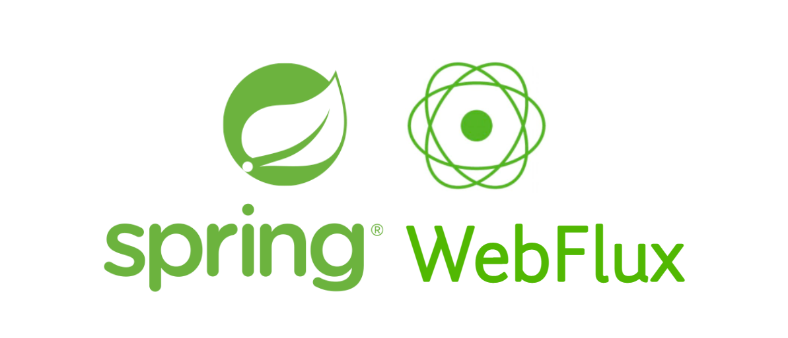

# [Spring Webflux](https://docs.spring.io/spring-framework/reference/web/webflux.html)



The reactive-stack web framework, Spring WebFlux, was added later in version 5.0. It is fully non-blocking, supports Reactive Streams back pressure, and runs on such servers as Netty, Undertow, and Servlet containers.

## 为什么需要创建Spring Webflux？

Spring官方给出了两个原因：
1. 需要利用更少的硬件资源来构建一个非阻塞式的Web处理容器，用于处理大量并发请网络请求。我们都知道异步的Servlet容器中有一些操作是同步的、或者是阻塞的，无法基于此构建大量并发请求的场景，所以使用了Netty容器，实现了非阻塞式的Web处理器。
2. 函数式编程为Java带来了生机，Java 8 中添加的 lambda 表达式也为 Java 中的函数式 API 创造了机会。这对于非阻塞应用程序和延续式 API（如 ReactiveX 所普及）来说是一个福音。Java 8 使 Spring WebFlux 能够提供功能性 Web 端点以及带注释的控制器。

## 组件架构
下面是Webflux的依赖的相关组件和架构：


从上面到下，可以分为四层， 可以看出，Webflux可以支持两种类型的API，一种是基于Spring MVC的注解式API，另一种是基于Router Function的函数式API，您可以根据您的需要进行选择。同时，Webflux是基于Reactor Stream进行的构建，所以Reactor Stream的所有语法Webflux都支持。容器方面，WebFlux 可以在支持 Servlet 3.1 非阻塞 IO API 的 Servlet 容器上运行，如Tomcat，也可以在异步容器(Netty 和 Undertow)上面运行。

### 与Spring MVC的关系

Spring MVC 还是 WebFlux？

这是一个很自然的问题，但却会造成一种不合理的二分法。实际上，两者共同努力扩大了可用选项的范围。两者的设计是为了彼此的连续性和一致性，它们可以并行使用，并且来自双方的反馈对双方都有利。


从技术选型的角度，我们建议你考虑如下几个点：
* 如果您有一个运行良好的 Spring MVC 应用程序，则无需进行更改。命令式编程是编写、理解和调试代码的最简单方法。您有最多的库选择，因为从历史上看，大多数库都是阻塞的。
* 如果您有一个调用远程服务的 Spring MVC 应用程序，请尝试响应式WebClient.
* 如果您有一个大型团队，请记住转向非阻塞、函数式和声明式编程的陡峭学习曲线。
* 如果您的系统对高并发，实时性有较高要求的系统，在做好全面评估的前提下，可以尝试使用。

## 搭建一个Spring WebFlux Application

下面我们就来搭建一个简单的WebFlux的demo

**1. 添加依赖**

```gradle
dependencies {
	implementation("org.springframework.boot:spring-boot-starter-webflux")
	implementation("com.fasterxml.jackson.module:jackson-module-kotlin")
	implementation("io.projectreactor.kotlin:reactor-kotlin-extensions")
	implementation("org.jetbrains.kotlin:kotlin-reflect")
	implementation("org.jetbrains.kotlinx:kotlinx-coroutines-reactor")
	testImplementation("org.springframework.boot:spring-boot-starter-test")
	testImplementation("io.projectreactor:reactor-test")
}
```

**2. 定义启动类**

我们可以定义整个应用程序的启动类：
```kotlin
@SpringBootApplication
class ReactiveDemoApplication

fun main(args: Array<String>) {
	runApplication<ReactiveDemoApplication>(*args)
}
```

**3. 定义Controller**

我们定义一个Controller
```
@RestController
@RequestMapping("/reactor")
class ReactiveController {

    @GetMapping
    fun getNumbers(): Flux<Long> {
        return Flux.interval(Duration.ofSeconds(1)).take(100)
    }
}
```

**4. 启动程序测试一下**

启动程序之后，我们发现在浏览器里面每个1秒钟就会打印出来一个数字：


**5. 将Controller转为Router**

由于Webflux支持Router函数，可以上面的Controller改写为下面的代码，其效果是一致的：

```kotlin
@Configuration
class ReactiveRouter {

    @Bean
    fun route() = router {
        GET("/route") { _ -> ServerResponse.ok().body(
            Flux.interval(Duration.ofSeconds(1)).take(100), Long::class.java)
        }
    }
}
```