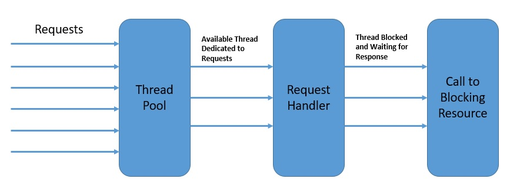

# Spring Webflux Core


前面我们简单了解了Webflux的背景，使用它完成了一个小Demo，今天我们就来深入学习它！

## spring-web

当客户端的请求抵达服务端时，将会对每个请求创建独立的线程，将其放到一个线程池中。`HTTP Handler`将轮询从线程池中取出请求，进行处理。整个流程大概如下：



这里`HTTP Handler`在Webflux中，最重要的是下面两个组件：

### HttpHandler

`HttpHander`是 Spring WebFlux 中的核心接口，用于处理底层的 HTTP 请求和响应。它是一个简单的处理程序接口，可以看作是一个函数，接收请求并生成响应。`HttpHandler` 在 WebFlux 中是底层的抽象，更接近于原始的 Servlet API。通常，您不直接使用`HttpHandler`，而是通过`WebHttpHandlerBuilder` 构建一个 WebHandler 或 WebFilter 来处理请求。

例如：
```java
import org.springframework.web.server.handler.DefaultWebFilterChain;
import org.springframework.web.server.handler.WebHandlerDecorator;

HttpHandler httpHandler = (serverHttpRequest, serverHttpResponse) -> {
    // 处理 HTTP 请求，并生成 HTTP 响应
    return serverHttpResponse.writeWith(Flux.just(...));
};

WebHandler webHandler = WebHandlerDecorator.from(httpHandler)
    .decorate(new DefaultWebFilterChain(handler, filters));
```

### WebHandlerAPI

`WebHandler` 和 `WebHandlerAPI` 是 Spring WebFlux 中的更高级别的抽象，它们是为了更方便地处理请求而设计的。`WebHandlerAPI` 是一个 Java 函数式接口，用于处理请求并生成响应。`WebHandler` 是 `WebHandlerAPI` 的一个实现类，它实现了 `WebHandlerAPI` 接口，用于处理 HTTP 请求。`WebHandler` 提供了更高级别的功能，比如处理路由和处理异常等。`WebHandler` 可以通过 `WebHandlerMapping` 或 `RouterFunction` 来处理请求。

例如：
```java
import org.springframework.http.server.reactive.HttpHandler;
import org.springframework.web.reactive.function.server.RouterFunction;
import org.springframework.web.server.adapter.WebHttpHandlerBuilder;

RouterFunction<?> routerFunction = ...; // 定义路由规则
WebHandler webHandler = RouterFunctions.toWebHandler(routerFunction);

HttpHandler httpHandler = WebHttpHandlerBuilder.webHandler(webHandler)
    .filter(new CustomWebFilter())
    .build();
```

## WebFilter

Reactive Stack 中最重要的组件之一是 WebFilter，它用于处理来自 HTTP 客户端的 Web 请求。

`WebFilter`的接口如下：
```kotlin
public interface WebFilter {
	Mono<Void> filter(ServerWebExchange exchange, WebFilterChain chain);
}
```

过滤器方法接受 ServerWebExchange，您可以在其中与 Web 请求交互并按照您在响应中预期的方式执行横切操作。
WebFilterChain类似于Servlet Filter中FilterChain的作用。 在运行时，一系列 WebFilter 可以链接起来在一个 Web 请求中执行。

例如：
```java
@Component
class CustomFilter : WebFilter {
    override fun filter(exchange: ServerWebExchange, chain: WebFilterChain): Mono<Void> {
        if(!exchange.getRequest().getQueryParams().containsKey("user")){
            exchange.getResponse().setStatusCode(HttpStatus.UNAUTHORIZED);
        }
        return chain.filter(exchange)
    }
}
```

## Handing Web Exceptions

我们知道，Spring Webflux给我们提供了两种API，一种是基于WebMVC注解的Controller实现，另一种是基于RouterFunction的实现，这两者对异常的处理有所不同。

### 基于Spring MVC注解的异常处理

下面我们举个例子来说明：
```java
public class PostNotFoundException extends RuntimeException {
    public PostNotFoundException(Long id) {
        super("Post:" + id +" is not found.");
    }
}

@GetMapping(value = "/{id}")
public Mono<Post> get(@PathVariable(value = "id") Long id) {
    return this.posts.findById(id).switchIfEmpty(Mono.error(new PostNotFoundException(id)));
}

@RestControllerAdvice
@Slf4j
class RestExceptionHandler {

    @ExceptionHandler(PostNotFoundException.class)
    ResponseEntity postNotFound(PostNotFoundException ex) {
        log.debug("handling exception::" + ex);
        return notFound().build();
    }

}
```

如果你了解Spring MVC的话，应该对上面的代码不陌生，基本上就是当业务代码通过Flux或者Mon抛出异常的时候，我们通过注解`@RestControllerAdvice`定义一个全局的切面处理器，在通过注解`@ExceptionHandler`定义方法来拦截相关的异常即可。


### 基于RouterFunction的异常处理

这种方式需要通过申明`WebExceptionHandler`来手动处理，例如：
```java
@Bean
public WebExceptionHandler exceptionHandler() {
    return (ServerWebExchange exchange, Throwable ex) -> {
        if (ex instanceof PostNotFoundException) {
            exchange.getResponse().setStatusCode(HttpStatus.NOT_FOUND);
            return exchange.getResponse().setComplete();
        }
        return Mono.error(ex);
    };
}
```

## CORS

Spring WebFlux使您可以处理CORS（跨域资源共享），主要有两种处理方式，一种是处理单个请求，在Controller级别添加配置实现，另一种可以做全局配置，对全局有效。

### 单个请求的跨域访问

可以使用注解`@CrossOrigin`来实现，可以在Controller上或者其方法上面添加该注释来实现，例如：
```java
@RestController
@RequestMapping("/account")
public class AccountController {
    @CrossOrigin
    @GetMapping("/{id}")
    public Account retrieve(@PathVariable Long id) {
        // ...
    }
}
```

### 全局CORS配置

除了细粒度的控制器方法级别配置外，您可能还想定义一些全局CORS配置。 您可以在任何HandlerMapping上分别设置基于URL的CorsConfiguration映射。 但是，大多数应用程序使用MVC Java配置或MVC XNM命名空间来执行此操作。要在MVC Java配置中启用CORS，可以使用CorsRegistry回调，如以下示例所示：

```java
@Configuration
@EnableWebMvc
public class WebConfig implements WebMvcConfigurer {

    @Override
    public void addCorsMappings(CorsRegistry registry) {

        registry.addMapping("/api/**")
            .allowedOrigins("https://domain2.com")
            .allowedMethods("PUT", "DELETE")
            .allowedHeaders("header1", "header2", "header3")
            .exposedHeaders("header1", "header2")
            .allowCredentials(true).maxAge(3600);

        // Add more mappings...
    }
}
```